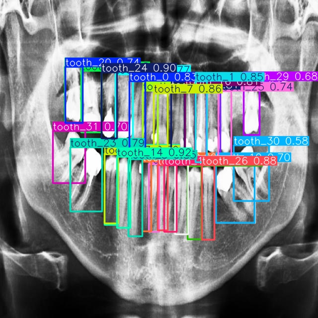

# 🦷 Tooth Detection using YOLO

This repository contains a **Tooth Detection System** built with the YOLO (You Only Look Once) object detection framework.  
A custom YOLOv11s model was trained on **497 dental X-ray images**, where 400 images were used for training and 97 for validation.  

---
## Exmaple Inference

  

---

## 📊 Results Summary
- **Average F1-Score:** 0.82  
- **Confidence Threshold:** 0.35  
- **Observations:** Some tooth classes achieved higher prediction accuracy due to more frequent representation in the dataset.  

